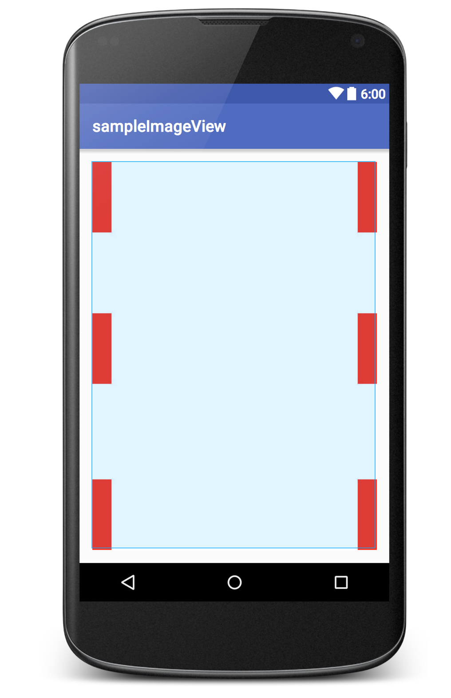
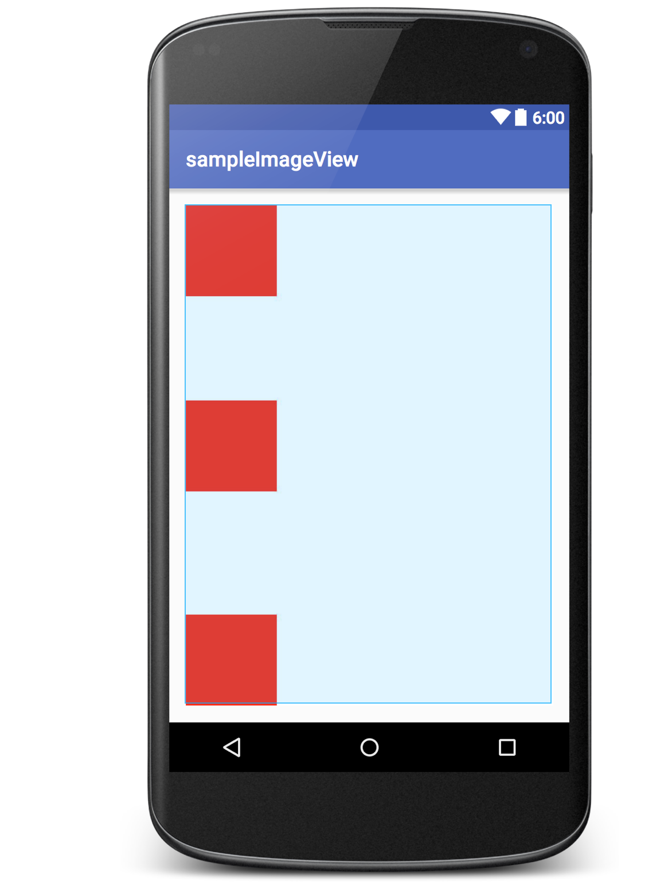
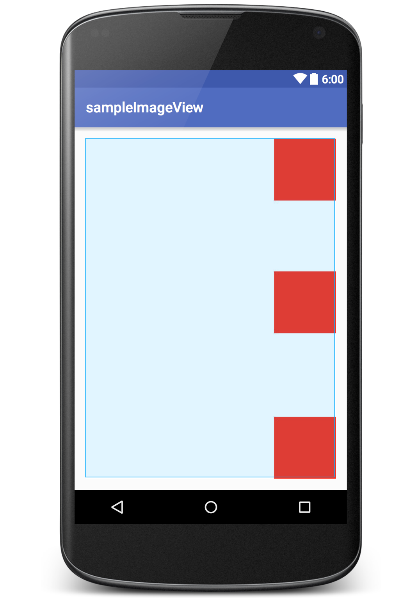

# AlignedImageView an Android ImageView Extension
 
 On many occasions we have problems to align the background image on an ImageView, especially when the image is loaded from the server.
 This extension scales and aligns the image as specified.
  
  You can specify the alignment as a view attribute. 
  
  You can download the library from below link:
  
  
  [Download releases](https://github.com/sarathdr/sampleImageView/releases)
  
  
  Example:
  
```xml
      
      <com.sarath.widget.AlignedImageView
            android:id="@+id/image_view"
            android:layout_width="match_parent"
            android:layout_height="match_parent"
            android:src="@drawable/img_to_align"
            img:alignDrawable="bottom_right" />
    
```
  
  Align: **center_center**
  
  

  Align: **bottom_left**
    
    
    
  Align: **bottom_right**
    